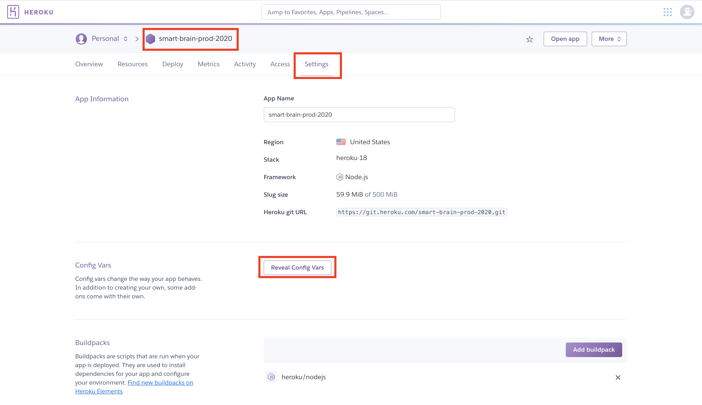

# smart-brain-prod

### Application link: [https://smart-brain-prod-2020.herokuapp.com/](https://smart-brain-prod-2020.herokuapp.com/)

### <span id="30.1">`Download & connect to your gitHub.`</span>

```bash
$ git clone https://github.com/DonghaoWu/smart-brain-prod.git
$ cd smart-brain-prod
$ rm -fr .git
$ git init
$ git add .
$ git commit -m "first commit"
$ git remote add origin <your-repo-link>
$ git push -u origin master
```

### Add a lambda endpoint and apply it in front end., [visit here.](https://github.com/DonghaoWu/WebDev-tools-demo/blob/master/AWS/AWS.md)

### <span id="30.2">`Run the application locally.`</span>


1. Install dependencies.

    ```bash
    $ npm i
    $ npm run installAll
    ```

2. [Download](https://redis.io/download) & Run redis server.

    ```bash
    $ cd
    $ cd redis-6.0.6
    $ src/redis-server
    ```

3. Local redis setup.

    __`Location: ./backend-smart-brain-api-prod/controllers/register.js`__

    __`Location: ./backend-smart-brain-api-prod/controllers/signin.js`__

    __`Location: ./backend-smart-brain-api-prod/middlewares/authorization.js`__

    ```js
    const redis = require('redis');
    const redisClient = redis.createClient(6379);
    ```

4. Add Local .env file.

    __`Location: ./backend-smart-brain-api-prod/.env`__

    ```env
    POSTGRES_CLIENT=<--->
    POSTGRES_HOST=<--->
    POSTGRES_USER=<--->
    POSTGRES_PASSWORD=<--->
    POSTGRES_DB=<--->

    API_KEY=<--->
    JWT_SECRET=<--->
    ```

5. Download, install [postgreSQL](https://www.postgresql.org/) & Local postgreSQL setup.

    __`Location: ./backend-smart-brain-api-prod/server.js`__

    ```js
    const db = knex({
      client: process.env.POSTGRES_CLIENT,
      connection: {
        host: process.env.POSTGRES_HOST,
        user: process.env.POSTGRES_USER,
        password: process.env.POSTGRES_PASSWORD,
        database: process.env.POSTGRES_DB
      }
    });
    ```

6. Create local postgreSQL database and tables:

    - Create database: postico [CHECK HERE](https://github.com/DonghaoWu/Weather-RNEP-heroku-new/blob/master/README.md)

    - Create tables:

    ```sql
    CREATE TABLE login (
        id serial PRIMARY KEY,
        hash VARCHAR(100) NOT NULL,
        email text UNIQUE NOT NULL
    );

    CREATE TABLE users (
        id serial PRIMARY KEY,
        name VARCHAR(100),
        email text UNIQUE NOT NULL,
        entries BIGINT DEFAULT 0,
        joined TIMESTAMP NOT NULL,
        pet VARCHAR(100),
        age BIGINT
    );
    ```

7. Run the application locally.

    ```bash
    $ npm run dev
    ```

### <span id="30.3">`Heroku deploy the application.`</span>


1. Create heroku app and addon redis & postgreSQL.

    ```bash
    $ heroku login 

    $ heroku create <your-heroku-app-name>

    heroku addons:create heroku-redis:hobby-dev 

    $ heroku addons:create heroku-postgresql:hobby-dev --name=<your-heroku-addon-db-name> 

    $ heroku addons:attach <your-heroku-addon-db-name> --app=<your-heroku-app-name>

    $ heroku pg:psql --app <your-heroku-app-name>
    ```

    ```sql
    CREATE TABLE login (
        id serial PRIMARY KEY,
        hash VARCHAR(100) NOT NULL,
        email text UNIQUE NOT NULL
    );

    CREATE TABLE users (
        id serial PRIMARY KEY,
        name VARCHAR(100),
        email text UNIQUE NOT NULL,
        entries BIGINT DEFAULT 0,
        joined TIMESTAMP NOT NULL,
        pet VARCHAR(100),
        age BIGINT
    );
    ```

    - Quit sql command line.
    ```bash
    \q
    ```

2. Heroku environment variables setup.

    ```diff
    + API_KEY
    + JWT_SECRET
    ```

  <p align="center">
  
  </p>

------------------------------------------------------------

<p align="center">

</p>

------------------------------------------------------------

3. Heroku redis setup.

    __`Location: ./backend-smart-brain-api-prod/controllers/register.js`__

    __`Location: ./backend-smart-brain-api-prod/controllers/signin.js`__

    __`Location: ./backend-smart-brain-api-prod/middlewares/authorization.js`__

    ```js
    const redis = require('redis');
    const redisClient = redis.createClient(process.env.REDIS_URL, {no_ready_check: true});
    ```

4. PostgreSQL database setup.

    __`Location: ./backend-smart-brain-api-prod/server.js`__

    ```js
    const pg = require('knex')({
      client: 'pg',
      connection: process.env.DATABASE_URL
    });
    ```

5. Deploy.

    ```bash
    git remote -v
    heroku git:remote -a <your-heroku-app-name>
    git add .
    git commit -m'ready for deploy'
    git push heroku master
    heroku ps:scale web=1
    heroku open
    ```

#### For more detail, please [visit here.](https://github.com/DonghaoWu/smart-brain-doc/blob/master/README.md)


