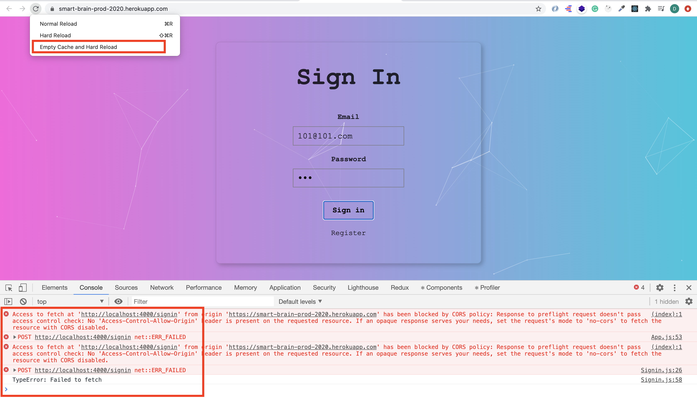

# smart-brain-prod

## `Download & connect to your gitHub.`

  ```bash
  $ git clone https://github.com/DonghaoWu/smart-brain-prod.git
  $ cd smart-brain-prod
  $ rm -fr .git
  $ git init
  $ git add .
  $ git commit -m "first commit"
  $ git remote add origin <your-repo-link>
  $ git push -u origin master
  ```

## `Run the application locally.`

1. Install dependencies.

    ```bash
    $ npm i
    $ npm run installAll
    ```

2. [Download](https://redis.io/download) & Run redis server.

    ```bash
    $ cd
    $ cd redis-6.0.6
    $ src/redis-server
    ```

    - 查看正使用的 redis 本地端口。

    ```bash
    $ ps aux | grep redis
    $ kill -9 <port-number> # stop a port redis service
    ```

    - 进入 redis CLI。

    ```bash
    $ cd
    $ cd redis-6.0.6
    $ src/redis-cli
    ```

3. Local redis setup.

    __`Location: ./backend-smart-brain-api-prod/controllers/register.js`__

    __`Location: ./backend-smart-brain-api-prod/controllers/signin.js`__

    __`Location: ./backend-smart-brain-api-prod/middlewares/authorization.js`__

    ```js
    const redis = require('redis');
    const redisClient = redis.createClient(6379);
    // const redisClient = redis.createClient();
    ```

4. Local .env file.

    __`Location: ./backend-smart-brain-api-prod/.env`__

    ```env
    POSTGRES_CLIENT=<--->
    POSTGRES_HOST=<--->
    POSTGRES_USER=<--->
    POSTGRES_PASSWORD=<--->
    POSTGRES_DB=<--->

    API_KEY=<--->
    JWT_SECRET=<--->
    ```

5. Download, install [postgreSQL](https://www.postgresql.org/) & Local postgreSQL setup.

    __`Location: ./backend-smart-brain-api-prod/server.js`__

    ```js
    const db = knex({
      client: process.env.POSTGRES_CLIENT,
      connection: {
        host: process.env.POSTGRES_HOST,
        user: process.env.POSTGRES_USER,
        password: process.env.POSTGRES_PASSWORD,
        database: process.env.POSTGRES_DB
      }
    });
    ```

    - 这里的 connection 可以使用 URI 代替，比如：[postgreSQL connection string](https://www.postgresql.org/docs/current/libpq-connect.html#LIBPQ-CONNSTRING)

6. Create postgreSQL database and tables:

    - Create database: postico [CHECK HERE](https://github.com/DonghaoWu/Weather-RNEP-heroku-new/blob/master/README.md)

    - Create tables:

    ```sql
    CREATE TABLE login (
        id serial PRIMARY KEY,
        hash VARCHAR(100) NOT NULL,
        email text UNIQUE NOT NULL
    );

    CREATE TABLE users (
        id serial PRIMARY KEY,
        name VARCHAR(100),
        email text UNIQUE NOT NULL,
        entries BIGINT DEFAULT 0,
        joined TIMESTAMP NOT NULL,
        pet VARCHAR(100),
        age BIGINT
    );
    ```

7. Run the application locally.

    ```bash
    $ npm run dev
    ```

## `Heroku deploy the application.`

1. Create heroku app and addon redis & postgreSQL.

    ```bash
    $ heroku login  # 登录 heroku

    $ heroku create <your-heroku-app-name> # 定制 app 名字

    heroku addons:create heroku-redis:hobby-dev # 新增一个 redis

    $ heroku addons:create heroku-postgresql:hobby-dev --name=<your-heroku-addon-db-name> # 新增一个 postgreSQL 的 database。

    $ heroku addons:attach <your-heroku-addon-db-name> --app=<your-heroku-app-name> # 设定 app 和 db 对接

    $ heroku pg:psql --app <your-heroku-app-name> # 进入 app 对应的 db 的命令行
    ```

    ```sql
    CREATE TABLE login (
        id serial PRIMARY KEY,
        hash VARCHAR(100) NOT NULL,
        email text UNIQUE NOT NULL
    );

    CREATE TABLE users (
        id serial PRIMARY KEY,
        name VARCHAR(100),
        email text UNIQUE NOT NULL,
        entries BIGINT DEFAULT 0,
        joined TIMESTAMP NOT NULL,
        pet VARCHAR(100),
        age BIGINT
    );
    ```

    - Quit sql command line.
    ```bash
    \q
    ```

2. Heroku environment variables setup.

    ```diff
    + DATABASE_URL
    + HEROKU_POSTGRESQL_GRAY_URL
    + REDIS_URL
    + API_KEY
    + JWT_SECRET
    ```

  <p align="center">
  
  </p>

------------------------------------------------------------

<p align="center">

</p>

------------------------------------------------------------


3. package.json，这一步的 scripts 设计需要严谨。

    __`Location: ./package.json`__

    ```json
    {
      "name": "smart-brain-prod",
      "version": "1.0.0",
      "description": "deploy on heroku without docker",
      "main": "./backend-smart-brain-api-prod/server.js",
      "scripts": {
        "installAll": "concurrently \"npm run installServer\" \"npm run installClient\"",
        "installServer": "cd backend-smart-brain-api-prod && npm install",
        "installClient": "cd frontend-smart-brain-prod && npm install",
        "dev": "concurrently \"npm run server\" \"npm run client\"",
        "client": "npm start --prefix frontend-smart-brain-prod",
        "server": "npm run server --prefix backend-smart-brain-api-prod",
        "start": "npm start --prefix backend-smart-brain-api-prod",
        "heroku-prebuild": "cd backend-smart-brain-api-prod && npm install",
        "heroku-postbuild": "cd frontend-smart-brain-prod && npm install --only=dev && npm install && npm run build"
      },
      "repository": {
        "type": "git",
        "url": "git+https://github.com/DonghaoWu/smart-brain-prod.git"
      },
      "keywords": [
        "heroku-deploy-without-docker"
      ],
      "author": "Donghao",
      "license": "ISC",
      "bugs": {
        "url": "https://github.com/DonghaoWu/smart-brain-prod/issues"
      },
      "homepage": "https://github.com/DonghaoWu/smart-brain-prod#readme",
      "devDependencies": {
        "concurrently": "^5.3.0"
      }
    }
    ```

4. Heroku redis setup.

    __`Location: ./backend-smart-brain-api-prod/controllers/register.js`__

    __`Location: ./backend-smart-brain-api-prod/controllers/signin.js`__

    __`Location: ./backend-smart-brain-api-prod/middlewares/authorization.js`__

    ```js
    const redis = require('redis');
    const redisClient = redis.createClient(process.env.REDIS_URL, {no_ready_check: true});
    ```

5. PostgreSQL database setup.

    __`Location: ./backend-smart-brain-api-prod/server.js`__

    ```js
    const pg = require('knex')({
      client: 'pg',
      connection: process.env.DATABASE_URL
    });
    ```

6. Add static file:

    __`Location: ./backend-smart-brain-api-prod/server.js`__

    ```js
    if (process.env.NODE_ENV === 'production') {
      app.use(express.static(path.join(__dirname, '../frontend-smart-brain-prod/build')));
      app.use((req, res) => {
        res.sendFile(path.join(__dirname, '../frontend-smart-brain-prod/build/index.html'));
      })
    }
    ```

7. Proxy in frontend. 

    __`Location: ./frontend-smart-brain-prod/package.json`__

    ```json
    "proxy": "http://localhost:4000"
    ```

    - 其实 proxy 是否添加对于 deploy 是没有影响的，主要是添加 proxy 之后前端的一些连接后端代码就需要改变，如：

    ```diff
    -   fetch('http://localhost:4000/signin', {
          method: 'post',
          headers: {
            'Content-type': 'application/json',
            'Authorization': token
          }
        })

    +   fetch('/signin', {
          method: 'post',
          headers: {
            'Content-type': 'application/json',
            'Authorization': token
          }
        })
    ```

    - 而且增加 proxy 重新 deploy 也会继续错误，这个时候需要点击浏览器上面的 :star::star::star: `Empty Cache and hard reload`. 这也是一个调试了很久的 bug。

    - :star::star: 所以一个好的开发习惯是加上 proxy 并简化前端 fetch link，这样在 deploy 的时候少一点 bug。

    - :star::star: Proxy 加上简化 fetch link 的作用在于方便本地调试，实际上但使用 fetch link 就可以 deploy。

    - 但是如果不改变的话 deploy 在 heroku 上面就会出现错误：

  <p align="center">
  
  </p>

  ------------------------------------------------------------

8. Deploy.

    ```bash
    git remote -v
    heroku git:remote -a <your-heroku-app-name>
    git add .
    git commit -m'ready for deploy'
    git push heroku master
    heroku ps:scale web=1
    heroku open
    ```

    - `git remote -v`: 检查当前 app 对应的所有 repos。


## `Other discussion.`

1. Should add pool? `NO.`

    ```js
    const db = require('knex')({
      client: 'pg',
      connection: process.env.DATABASE_URL,
      pool: { min: 0, max: 10 }
    });
    ```

2. Should delete this part in .gitignore? `NO.`

    ```json
    # production
    /build
    ```

3. Should change these code in server.js? `NO.`

    ```js
    // const app = express();
    // app.use(morgan('tiny'));
    // app.use(cors());
    // app.use(bodyParser.json());

    const app = express();
    app.use(express.json());
    app.use(express.urlencoded({ extended: false }));
    app.use(bodyParser.json());
    ```

4. Should change backend port? `NO.`

5. 常见错误：

<p align="center">

</p>

----------------------------------------------------------

6. 知道处理错误时 在哪里添加 console.log，上一个未知错误的发现是在 signin.js 中的 signinAuthentication 的 catch block 中加入 `console.log(err)`，如：

    __`Location: ./backend-smart-brain-api-prod/controllers/signin.js`__

    ```diff
    const signinAuthentication = (req, res, db, bcrypt) => {
      const { authorization } = req.headers;
      return authorization ? hasTokenAndGetIdFromRedis(req, res)
        : noTokenSigninAndGetUser(req, res, db, bcrypt)
          .then(data => {
            return data.id && data.email ? createSession(data) : Promise.reject(data)
          })
          .then(session => {
            return res.json(session);
          })
          .catch(err => {
    +       console.log(err)
            return res.status(400).json(err)
          });
    }
    ```


